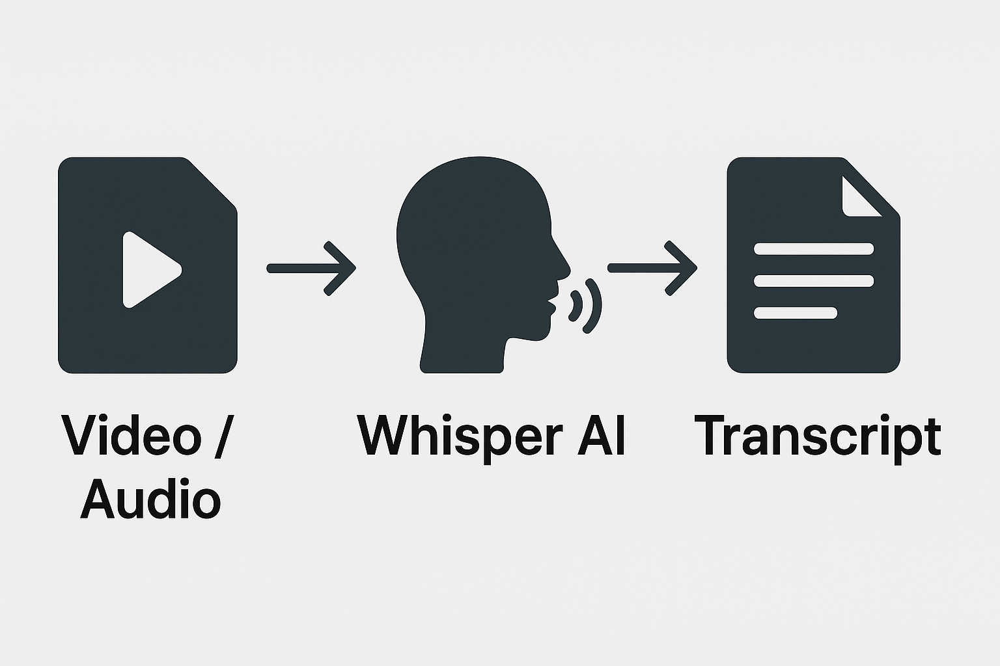

# whisper-offline-video-audio-transcriber
"An offline video &amp; audio transcription tool powered by OpenAI Whisper. Convert your tutorials, lectures, and podcasts into accurate text transcripts and use AI to generate summaries, notes, and mind maps — saving hours of time and boosting productivity."



# 🎧 Offline Video & Audio Transcription Tool using OpenAI Whisper

Convert your offline video tutorials and audio lectures into clean, accurate transcripts — securely, privately, and without uploading anything online.

This project uses **OpenAI Whisper** to transcribe `.mp4`, `.mkv`, `.avi`, `.mov`, and `.mp3` files directly on your PC.  
Unlike online transcribers, your data never leaves your system, making it **100% private and safe**.

---

## 🚀 Why I Built This Project
I had a huge library of offline video tutorials and wanted an efficient way to:
- Convert videos into text transcripts.
- Feed transcripts into AI tools.
- Generate detailed summaries, notes, and mind maps.

This saved me a massive amount of time and energy.  
Instead of manually watching hours of videos, pausing in between, and taking notes, the process is now fully automated.

---

## 🔐 Why Offline Transcription is Better

| Feature           | Online Transcribers              | This Project (Offline)       |
|-------------------|----------------------------------|-------------------------------|
| **Privacy**       | ❌ Data uploaded to servers      | ✅ 100% local, private        |
| **Speed**         | ⏳ Depends on internet           | ⚡ Faster (no upload needed)  |
| **File Size**     | ❌ Often limited                 | ✅ No restrictions            |
| **Cost**          | 💰 Premium plans needed          | ✅ Completely free            |
| **AI Accuracy**   | ⚠️ Varies                       | ✅ Uses OpenAI Whisper (highly accurate) |

👉 **Bottom Line**: Your videos stay on your PC, no risk of data leaks, no size limits, and better control over your transcripts.

---

## 📦 Installation & Setup

### 1. Install Python  
- Download [Python 3.10+](https://www.python.org/downloads/) (recommended).  
- Run the installer and check ✅ **Add Python to PATH**.  
- Verify installation:
```bash
python --version
```

### For Linux 🐧
```bash
sudo apt update && sudo apt install python3 python3-pip -y
python3 --version
```
# 2. Install FFmpeg (Required for Whisper)

Whisper uses FFmpeg internally to process audio and video files.

## For Windows 🪟

1.  Download FFmpeg from [https://ffmpeg.org/download.html](https://ffmpeg.org/download.html).
2.  Extract the downloaded ZIP file to:
    ```
    C:\ffmpeg
    ```
3.  Add FFmpeg to your system's PATH environment variable:
    *   Open the Start Menu and search for "Environment Variables".
    *   Click on **"Edit the system environment variables"**.
    *   In the System Properties window, click the **"Environment Variables..."** button.
    *   Under the **"System variables"** section, find and select the **`Path`** variable.
    *   Click **"Edit..."**.
    *   Click **"New"** and add the following path:
        ```
        C:\ffmpeg\bin
        ```
    *   Click **OK** to close all dialogs.
4.  **Check the installation:**
    Open a new Command Prompt or PowerShell window and run:
    ```bash
    ffmpeg -version
    ```

## For Linux 🐧

Run the following commands in your terminal:

1.  Update package lists and install FFmpeg:
    ```bash
    sudo apt update && sudo apt install ffmpeg -y
    ```
2.  **Check the installation:**
    ```bash
    ffmpeg -version
    ```
    
# 3. Create a Project Folder

1.  Choose a location for your project, for example:
    ```
    C:\Users\YourUserName\Videos
    ```
2.  Inside this main project folder, create the following two subfolders:
    *   `ccvideos` - Place your video files here.
    *   `caption` - Whisper will save the generated transcript files here.

# 4. Install Whisper

## For Windows 🪟
Open **Command Prompt** or **PowerShell** and run the following command:
```bash
pip install openai-whisper
```
# For Linux 🐧
Open your terminal and run:

```bash
pip3 install openai-whisper
```
# 5. Install PyTorch (For Faster Processing)

Whisper performs significantly better when using PyTorch as its backend.

## For Windows & Linux

Open your command line interface (Command Prompt/PowerShell on Windows, Terminal on Linux) and run:

```bash
pip install torch torchvision torchaudio
```
# 6. Download and Save the Script

1.  Copy the provided Python script (e.g., `transcriber.py`).
2.  Save the file into your main project folder (e.g., `C:\Users\YourUserName\Videos`).

# 7. Update the Folder Paths in the Script

Open the `transcriber.py` script in a text editor (like Notepad++, VS Code, or any code editor).

Find the lines that define the folder paths and update them to match your specific project folder. Use raw strings (prefix `r`) to avoid issues with backslashes in Windows paths.

**Update these variables:**

```python
video_folder = r"C:\Users\YourUserName\Videos\ccvideos"
output_folder = r"C:\Users\YourUserName\Videos\caption"
```
- **Ensure** the path to your `ccvideos` folder (where videos are stored) is correct.
- **Ensure** the path to your `caption` folder (where transcripts will be saved) is correct.

# 8. Run the Script

## For Windows 🪟
Open **Command Prompt** or **PowerShell**, navigate to your project directory, and run:

    python transcriber.py

## For Linux 🐧
Open your **terminal**, navigate to your project directory, and run:

    python3 transcriber.py

## 9. Use the Skip / Pause / Play Feature

When the script processes each video, it will ask:

▶ Video: sample.mp4
Press [Enter] to continue, [S] to skip, [P] to pause:


- **Press Enter** → Starts transcription  
- **Press S** → Skips the current video  
- **Press P** → Pauses the process (press Enter again to resume)  

---

## 10. Get Your Transcripts

- Once completed, the transcripts will be saved automatically in your **caption** folder.  
- Each `.txt` file will have the same name as your video.  
